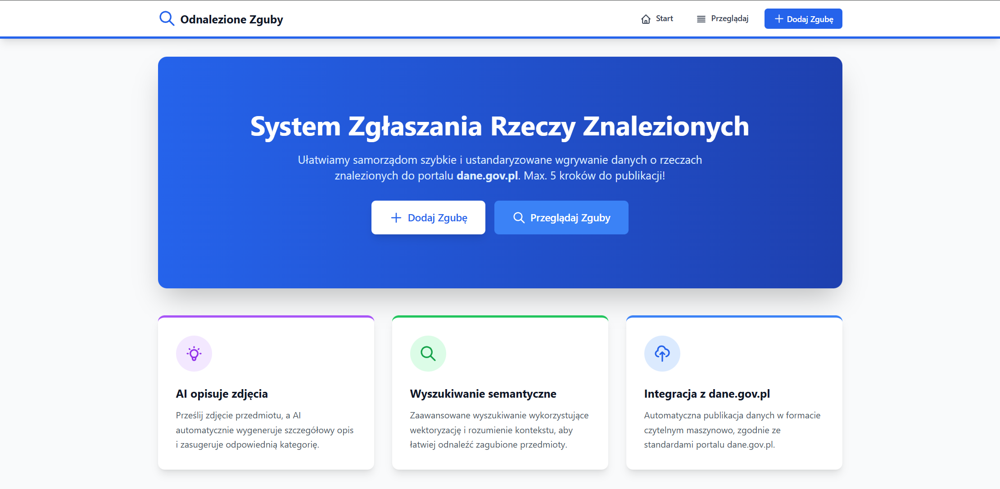
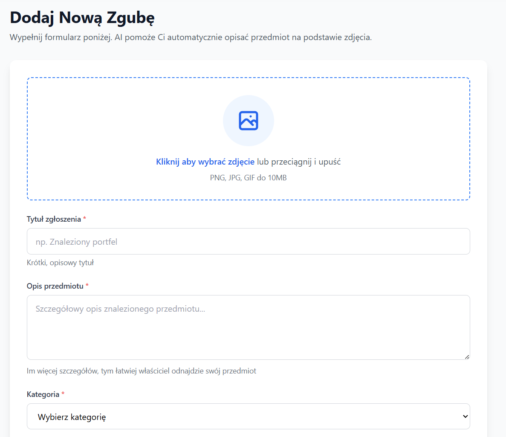
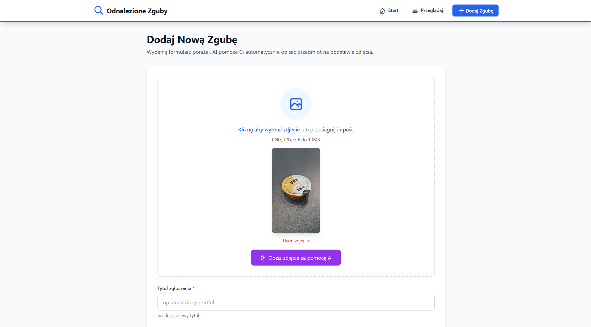
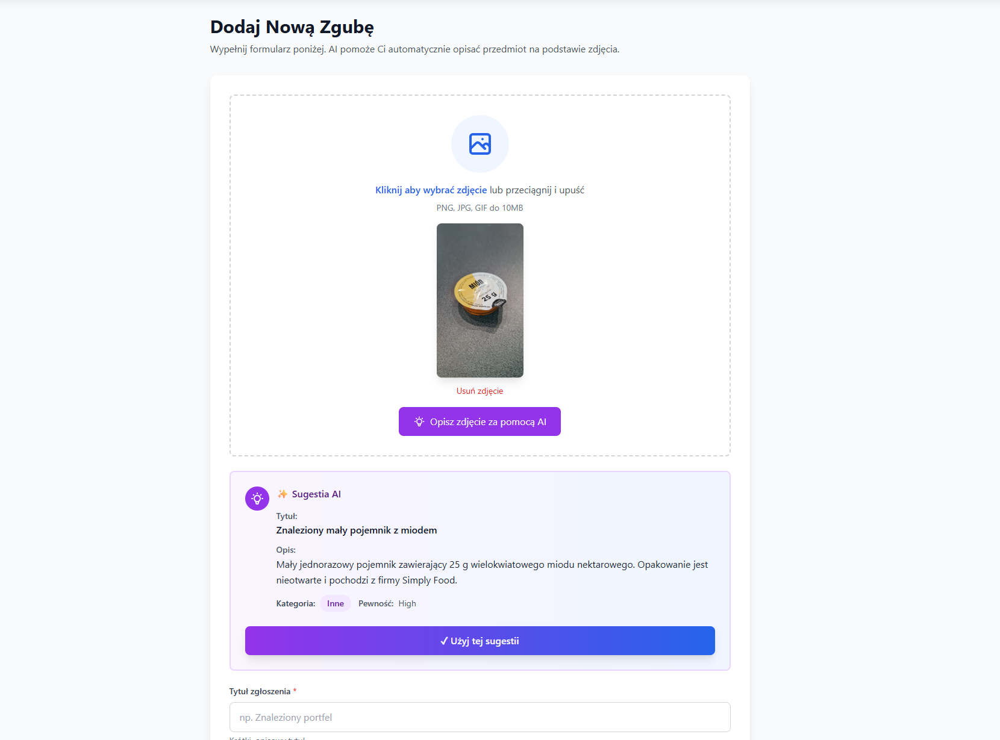
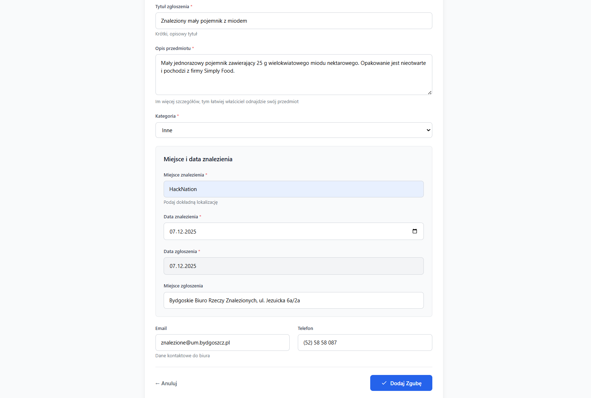
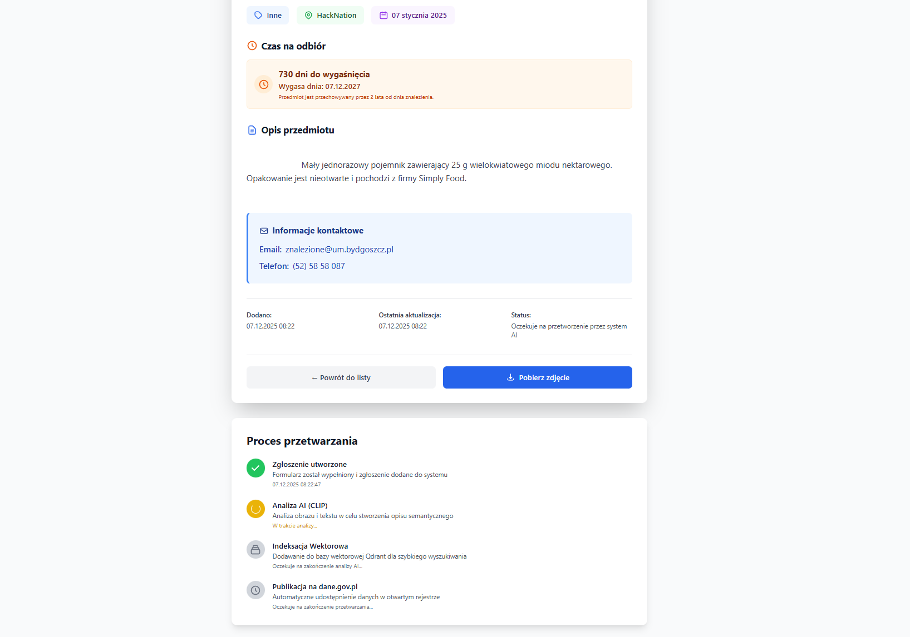
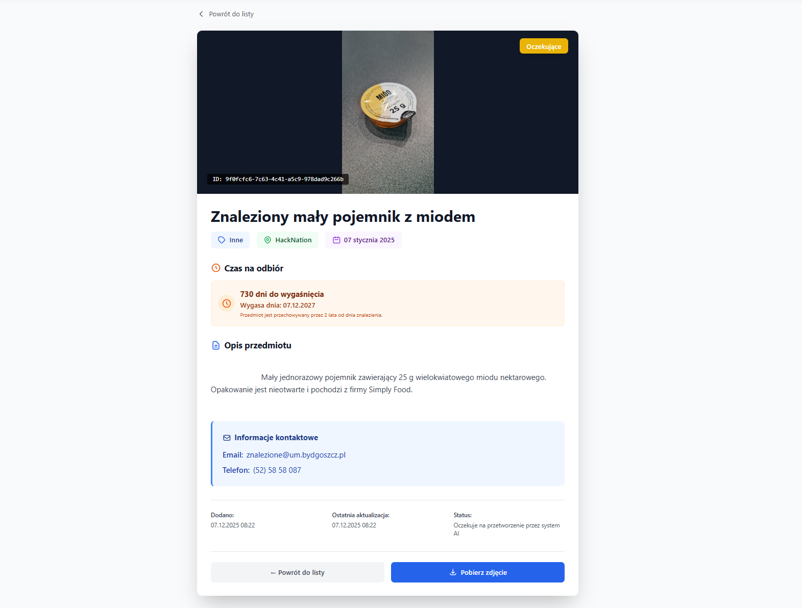

# 🏆 HACKNATION - Odnalezione Zguby

## 📋 Project Information

### Tags

`#GovTech` `#AI` `#OpenData` `#SemanticSearch` `#Microservices` `#DataStandardization` `#CLIP` `#VectorDatabase` `#EventDriven` `#dane.gov.pl`

### Project Type

**🏛️ GovTech Solution** - Software app for public administration and integration

### Short Tagline

**"AI-powered lost & found system that automatically publishes municipal data to dane.gov.pl and provide semantical search for lost items"**

---

## 📖 Project Description

### The Problem

Polish municipalities are legally obligated to manage found items and publish this data on **dane.gov.pl** (Poland's open data portal). However:

**Result**: Citizens struggle to find their lost belongings, municipalities waste resources, and the open data initiative suffers from poor adoption.

### Our Solution

**"Odnalezione Zguby"** is an intelligent, AI-powered microservices platform that revolutionizes how municipalities handle lost items:

#### 🎯 Key Features

1. **5-Click Item Submission**

    - Upload photo → AI analyzes → Suggests description → Review → Submit
    - Reduces submission time from 20 minutes to **under 2 minutes**

2. **AI-Powered Description Generation**

    - Vision API (GPT-4o) analyzes uploaded photos
    - Automatically suggests: description, category, and metadata
    - Multilingual support (Polish + international)

3. **Semantic Search with CLIP**

    - Natural language queries: "niebieska torebka damska"
    - Image similarity search
    - 512-dimensional vector embeddings
    - Cosine similarity matching

4. **Automated dane.gov.pl Integration**

    - One-click dataset creation
    - Automatic DCAT-AP PL formatting
    - Real-time synchronization
    - Compliant with Polish open data standards

5. **Event-Driven Architecture**
    - Asynchronous processing
    - High scalability
    - Fault-tolerant design
    - Real-time updates

---

## 🏗️ Technical Architecture

### Microservices Stack

```
┌────────────────────────────────────────────────────────────┐
│                    ODNALEZIONE ZGUBY                       │
│         AI-Powered Lost & Found Management System          │
└────────────────────────────────────────────────────────────┘

┌──────────────────┐    ┌──────────────────┐    ┌──────────────────┐
│  Service A       │    │  Service B       │    │  Service C       │
│  Gateway         │───▶│  CLIP Worker     │───▶│  Publisher       │
│  (Go + HTMX)     │    │  (Python)        │    │  (Go)            │
│  Port: 8080      │    │  ML Pipeline     │    │  dane.gov.pl API │
└──────────────────┘    └──────────────────┘    └──────────────────┘
         │                       │                       │
         └───────────────────────┼───────────────────────┘
                                 ▼
                    ┌────────────────────────┐
                    │  Infrastructure Layer  │
                    ├────────────────────────┤
                    │  • RabbitMQ (5672)    │
                    │  • MinIO S3 (9000)    │
                    │  • Qdrant DB (6333)   │
                    │  • PostgreSQL (5432)  │
                    └────────────────────────┘
```

### Component Details

#### 🖥️ Service A: Gateway (Frontend)

-   **Tech**: Go 1.21, HTMX, Tailwind CSS, Alpine.js
-   **Role**: User interface for municipal workers
-   **Features**:
    -   Real-time AI photo analysis
    -   Form validation with legal compliance
    -   MinIO S3 image storage
    -   Event publishing to RabbitMQ

#### 🧠 Service B: CLIP Worker (AI Engine)

-   **Tech**: Python 3.11, PyTorch, Transformers, CLIP
-   **Role**: Machine learning pipeline
-   **Features**:
    -   Text embedding (sentence-transformers/clip-ViT-B-32-multilingual-v1)
    -   Image embedding (openai/clip-vit-base-patch32)
    -   512-dimensional vectors
    -   Multilingual support (Polish, English, German, etc.)

#### 📤 Service C: Publisher (Integration)

-   **Tech**: Go 1.21, REST API Client
-   **Role**: dane.gov.pl integration
-   **Features**:
    -   DCAT-AP PL standard formatting
    -   Automatic authentication
    -   Dataset management
    -   Resource publishing

#### 🔍 Service D: Qdrant Service (Vector DB)

-   **Tech**: Go 1.21, Qdrant gRPC Client
-   **Role**: Vector database management
-   **Features**:
    -   Cosine similarity search
    -   Real-time indexing
    -   Batch operations
    -   Collection management

### Technology Stack

| Category           | Technologies                                        |
| ------------------ | --------------------------------------------------- |
| **Backend**        | Go 1.21, Python 3.11                                |
| **Frontend**       | HTMX, Tailwind CSS, Alpine.js                       |
| **AI/ML**          | CLIP (OpenAI), GPT-4o Vision, PyTorch, Transformers |
| **Databases**      | Qdrant (Vector DB), PostgreSQL 15, MinIO (S3)       |
| **Messaging**      | RabbitMQ 3.12 (Topic Exchange)                      |
| **Infrastructure** | Docker, Docker Compose                              |
| **APIs**           | REST, gRPC, OpenAI API                              |

---

## 🎬 Demo & Resources

### 🌐 Live Demo

**URL**: `https://visionlink.jdex.pl/`

### 📹 Video Presentation

**YouTube**: `https://youtu.be/5JFhqebSRmc`

## 📸 System Screenshots - Complete User Journey

### 1. 🏠 Landing Page



---

### 2. 📝 Add New Item - Empty Form



---

### 3. 📷 Photo Upload



**Image Processing:**

-   Instant preview of uploaded photo
-   File validation (type, size)
-   Triggers AI analysis automatically
-   Progress indicator

---

### 4. 🤖 AI Suggestion Generated



**GPT-4o Vision Magic:**

-   ✨ **Automatic description**: "Blue backpack with laptop compartment"
-   🏷️ **Category suggested**: "Bags & Backpacks"
-   📋 **Characteristics detected**: Color, type, features
-   ⏱️ **Processing time**: ~2-3 seconds
-   👤 **User control**: Review and modify before submission

---

### 5. ✅ Using AI Suggestions



**One-Click Acceptance:**

---

### 6. ⚙️ Item Processing



**Real-Time Status Updates:**

-   Item successfully submitted ✅
-   Background processing active:
    -   Image stored in MinIO
    -   CLIP embedding generation
    -   Qdrant vector indexing
-   Event flow visualization
-   User can continue working immediately

---

### 7. 📄 Item Details - Complete



**Comprehensive Item View:**

-   Full metadata displayed
-   **Legal information**: 2-year retention period (Art. 187 KC)
-   Expiration countdown (days remaining)
-   Ready for dane.gov.pl publishing

---

### 8. 🔍 Semantic Search in Action


**Intelligent Search Results:**

-   **Search query**: "niebieska torebka" (blue bag)
-   **CLIP-powered matching**: Understands semantics, not just keywords
-   **Visual similarity**: Items ranked by vector similarity
-   **Result quality**: Relevant items with similarity scores

**Key Features Demonstrated:**

---

### ✅ AI/ML Working in Production

-   **GPT-4o Vision**: Actually generating meaningful descriptions
-   **CLIP Embeddings**: Semantic search returns relevant results

### ✅ Technical Implementation

-   **Event-Driven**: Background processing doesn't block users
-   **Scalable**: Services communicate via RabbitMQ

### ✅ Legal Compliance

-   **Art. 187 KC**: 2-year retention period displayed
-   **Transparency**: Expiration dates clearly shown
-   **Data Quality**: Standardized categorization
-   **Automatic publishing** to dane.gov.pl

---

## 💡 Innovation Highlights

### 1. **AI-First Approach**

-   First Polish municipal system using CLIP for semantic search
-   Vision API reduces data entry time by 90%

### 2. **Event-Driven Architecture**

-   Async processing = no waiting for users
-   Fault-tolerant (messages persist in RabbitMQ)
-   Horizontally scalable (add more workers)

### 3. **Standards Compliance**

-   DCAT-AP PL format
-   RESTful API design

### 4. **User Experience**

-   No technical knowledge required

### 5. **Open Data Excellence**

-   Machine-readable formats
-   Automatic synchronization
-   Real-time updates to dane.gov.pl

---

## 📚 Documentation

### For Developers

-   📘 [Complete System Setup](COMPLETE_SYSTEM_SETUP.md)
-   🔄 [Event Flow Architecture](EVENT_FLOW.md)
-   📨 [Message Payloads](PAYLOADS.md)
-   🐇 [RabbitMQ Configuration](RabbitMQ.md)

### Service Documentation

-   🖥️ [Service A: Gateway README](service-a-gateway/README.md)
-   🧠 [Service B: CLIP Worker README](clip-service/README.md)
-   📤 [Service C: Publisher README](service-c-publisher/README.md)
-   🔍 [Service D: Qdrant Service README](qdrant-service/README.md)

---

**GitHub Repository**: https://github.com/JDEX-Coding/hacknation-odnalezione-zguby

**Live Demo**: https://visionlink.jdex.pl/

**Issues & Support**: https://github.com/JDEX-Coding/hacknation-odnalezione-zguby/issues

**Documentation**: Complete docs available in repository

---

_HackNation 2025 Submission_
