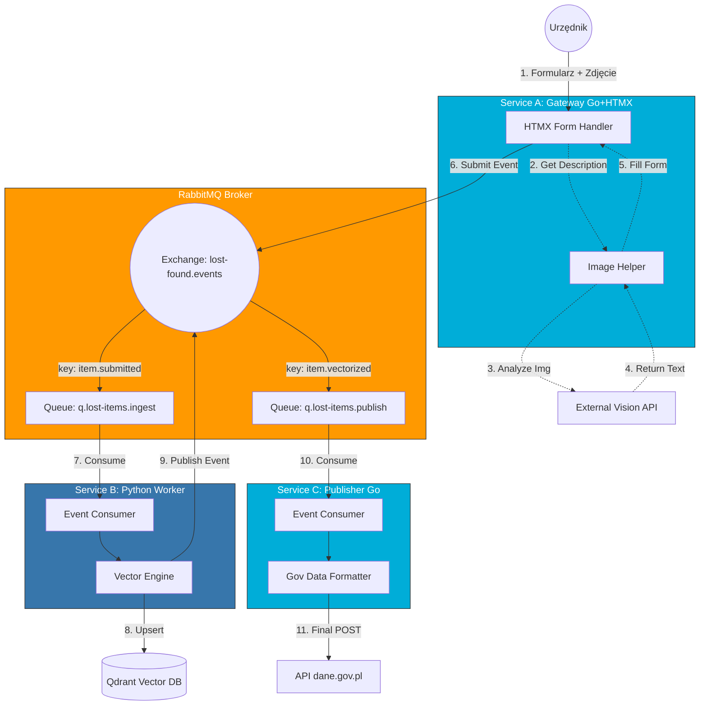

# System "Odnalezione Zguby" - Integracja z dane.gov.pl

[cite_start]Projekt systemu realizujący wyzwanie hackathonowe, ułatwiający samorządom szybkie (max. 5 kroków) i ustandaryzowane wgrywanie danych o rzeczach znalezionych do portalu **dane.gov.pl**[cite: 12, 20]. [cite_start]System wykorzystuje AI do opisywania zdjęć oraz wektoryzację (Qdrant) dla wyszukiwania semantycznego, spełniając wymóg dostarczania danych w formacie czytelnym maszynowo[cite: 8, 29].

## 🏗 Architektura Systemu

Architektura oparta jest na mikroserwisach i asynchronicznym przetwarzaniu zdarzeń. Składa się z trzech głównych serwisów:

### Komponenty:

1.  **Service A: Gateway (Go + HTMX)**

    -   **Rola:** Interfejs dla urzędnika (Frontend) i punkt wejścia danych.
    -   **Zadania:**
        -   Obsługa formularza HTMX.
        -   Komunikacja z **Vision API** (np. GPT-4o/LLaVA) w czasie rzeczywistym, aby wygenerować opis przedmiotu na podstawie wgranego zdjęcia (wsparcie UX).
        -   Walidacja wstępna i wysłanie zdarzenia `ItemSubmitted` do RabbitMQ.

2.  **Service B: AI Worker (Python)**

    -   **Rola:** Przetwarzanie semantyczne (Heavy lifting).
    -   **Zadania:**
        -   Konsumpcja zdarzeń z kolejki `q.lost-items.ingest`.
        -   Generowanie embeddingów (wektorów) dla tekstu i obrazu.
        -   Zapis metadanych wektorowych do bazy **Qdrant**.
        -   Emisja zdarzenia `ItemVectorized` do RabbitMQ.

3.  **Service C: Publisher (Go)**

    -   **Rola:** Integracja z API rządowym.
    -   **Zadania:**
        -   Konsumpcja przetworzonych danych z kolejki `q.lost-items.publish`.
        -   [cite_start]Konwersja danych do standardu wymaganego przez dane.gov.pl (JSON-LD / CSV)[cite: 29].
        -   Autoryzacja i wysyłka danych (POST) do API portalu.

4.  **Infrastruktura:**
    -   **RabbitMQ:** Message Broker (Topic Exchange `lost-found.events`).
    -   **Qdrant:** Baza wektorowa.

---

### 📊 Diagram Przepływu

