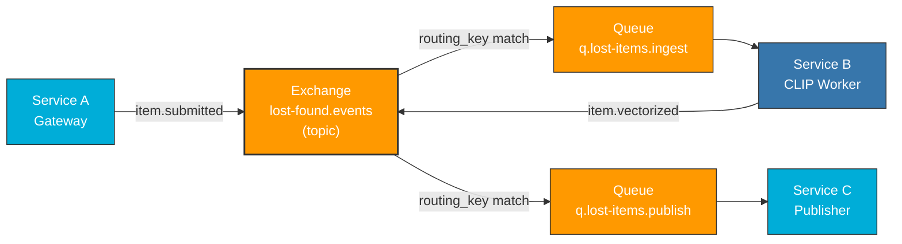

# 🐇 RabbitMQ - Message Broker Configuration

System "Odnalezione Zguby" wykorzystuje **RabbitMQ** jako centralny message broker dla asynchronicznej komunikacji między serwisami.

## 🏗️ Architektura Kolejkowania



## 📊 Kolejki i Routing

| Kolejka                | Routing Key       | Nadawca                     | Odbiorca                    | Opis                                                               |
| ---------------------- | ----------------- | --------------------------- | --------------------------- | ------------------------------------------------------------------ |
| `q.lost-items.ingest`  | `item.submitted`  | **Service A** (Gateway)     | **Service B** (CLIP Worker) | Surowe dane zgłoszenia + URL zdjęcia z MinIO                       |
| `q.lost-items.publish` | `item.vectorized` | **Service B** (CLIP Worker) | **Service C** (Publisher)   | Dane wzbogacone o embedding ID, gotowe do konwersji do dane.gov.pl |

## 🔌 Exchange Configuration

```yaml
name: lost-found.events
type: topic
durable: true
auto_delete: false
```

## 📨 Event Flow

### 1️⃣ **item.submitted** Event

```json
{
    "id": "uuid-v4",
    "title": "Znaleziony portfel",
    "description": "Czarny portfel skórzany ze znalezionym dowód osobistym",
    "category": "Portfele i torby",
    "location": "Warszawa, Rynek Starego Miasta",
    "found_date": "2024-12-06T10:30:00Z",
    "image_url": "http://minio:9000/lost-items-images/uploads/2024-12-06/uuid.jpg",
    "contact_info": "biuro@urzad.pl",
    "timestamp": "2024-12-06T10:35:00Z"
}
```

**Wysyłane z:** Service A (Gateway)
**Wymagane przez:** Service B (CLIP Worker)

### 2️⃣ **item.vectorized** Event

```json
{
  "id": "uuid-v4",
  "request_id": "uuid-v4-original",
  "original_data": {
    "title": "Znaleziony portfel",
    "description": "Czarny portfel skórzany...",
    "category": "Portfele i torby",
    "location": "Warszawa, Rynek Starego Miasta",
    "image_url": "http://minio:9000/lost-items-images/uploads/2024-12-06/uuid.jpg",
    "contact_info": "biuro@urzad.pl"
  },
  "vector_embedding": [0.123, 0.456, ..., 0.789],  // 384-dim CLIP embedding
  "vector_id": "qdrant-vector-id",
  "processing_time_ms": 2345,
  "processed_at": "2024-12-06T10:37:00Z"
}
```

**Wysyłane z:** Service B (CLIP Worker)
**Wymagane przez:** Service C (Publisher)
